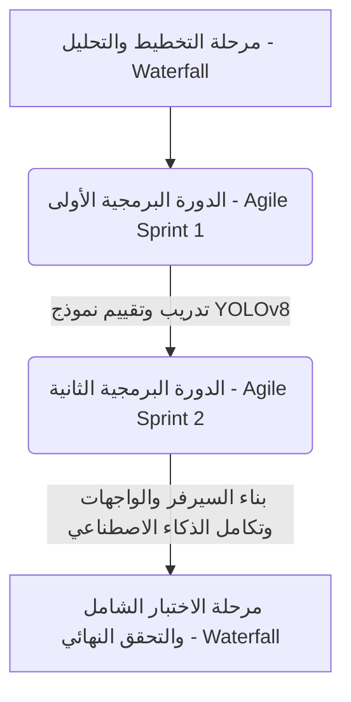
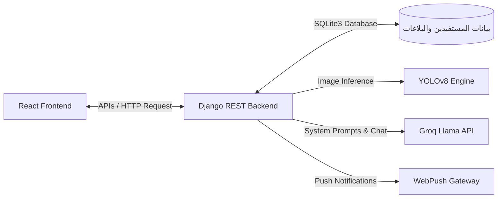
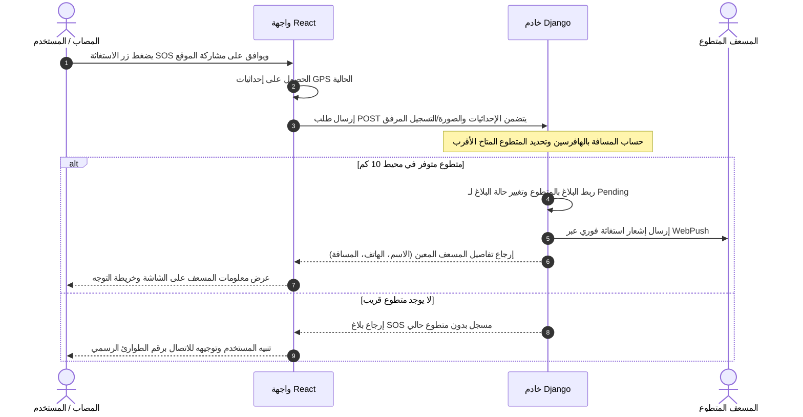
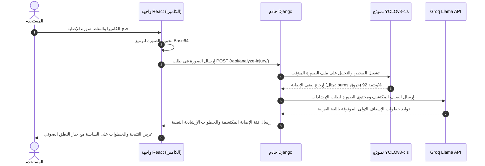

# وثيقة مشروع تخرج: تطبيق مسعف (Musaef) لإدارة الاستغاثات الطبية وتصنيف الإصابات باستخدام الذكاء الاصطناعي

---

## غلاف المشروع

**كلية تقنية الحاسوب – طرابلس**  
**قسم تقنيات البرمجة**  

### تطبيق مسعف (Musaef) لإدارة الاستغاثات الطبية الطارئة وتصنيف الإصابات باستخدام الذكاء الاصطناعي

**مشروع تخرج مقدم من ضمن متطلبات الحصول على درجة البكالوريوس في مجال تقنيات البرمجة**

#### إعداد الطلاب:
* **صادق خليفة محمد قشوط** (رقم قيد: 192140)
* **أحمد محمد أحمد بادي** (رقم قيد: 222015)

#### إشراف:
* **أ. الصادق الحمزاوي**

**ربيع 2026**

---

## الإهداء

إلى من كان لهم الفضل بعد الله في الوصول إلى هذه المرحلة،  
إلى والدينا الأعزاء الذين لم يبخلوا علينا بدعمهم وتضحياتهم،  
إلى إخوتنا وأصدقائنا الذين شاركونا رحلة السعي والجهد،  
إلى كل من آمن بنا وساندنا بكلمة أو دعاء أو تشجيع،  
نهدي هذا العمل المتواضع تعبيراً عن امتناننا وتقديرنا الصادق،  
سائلين الله أن يجعله ثمرة علم نافعة، وبداية طريق نحو مستقبل أفضل.

---

## الشكر والتقدير

بكل فخر وامتنان، نتقدم بجزيل الشكر والتقدير إلى مشرفنا الفاضل **الأستاذ الصادق الحمزاوي**، على ما قدّمه لنا من دعم وتوجيه طيلة فترة تنفيذ هذا المشروع، وعلى ما أبداه من حرص ومتابعة دقيقة ساعدتنا في تجاوز الصعوبات وتحقيق أهداف العمل.  
كما نتوجه بخالص الشكر والعرفان إلى أساتذتنا في قسم تقنيات البرمجة على جهودهم القيّمة وما قدّموه لنا من علم ومعرفة كانت الأساس في إنجاز هذا المشروع.  
ولا يفوتنا أن نعرب عن تقديرنا العميق إلى أسرنا وأصدقائنا على دعمهم المتواصل وتشجيعهم لنا خلال فترة الدراسة والعمل.  
جزاكم الله خير الجزاء، وجعل ما قدّمتم في ميزان حسناتكم.

---

## المستخلص (Abstract)

يُشكّل التدخل السريع وتقديم الإسعافات الأولية الصحيحة في اللحظات الأولى من وقوع الحادث عاملاً حاسماً في إنقاذ الأرواح وتقليل المضاعفات الصحية الخطيرة. ومع الانتشار الواسع للهواتف الذكية وتطور تقنيات الذكاء الاصطناعي، أصبح من الممكن تصميم أنظمة برمجية تساهم في سد الفجوة بين المصابين والمسعفين، وتقديم توجيهات طبية فورية دقيقة.

يقدّم هذا المشروع تطبيق **"مسعف" (Musaef)**، وهو نظام متكامل يتكون من تطبيق ويب تفاعلي (React + Vite) وخلفية برمجية متقدمة (Django REST Framework)، مدعوماً بنموذج رؤية حاسوبية ذكي يعتمد على خوارزمية **YOLOv8** لتصنيف الإصابات المرئية (حروق، جروح، لدغات ثعابين، وحالات طبيعية) في الزمن الحقيقي. كما يدمج التطبيق نموذج لغوي كبير (**Groq Llama**) لتحليل الصور وتقديم إرشادات إسعافية فورية باللغة العربية بناءً على نوع الإصابة المكتشفة، إلى جانب توفير محادثة طبية إرشادية ذكية لمساعدة المستخدمين.

يتميز التطبيق بتوفير نظام استغاثة طارئ (**SOS Alert**) يقوم بتحديد موقع المصاب بدقة عبر إحداثيات GPS، ومن ثم البحث عن أقرب مسعف متطوع متاح في نطاق جغرافي محدد (10 كم) باستخدام معادلة الهافرسين (Haversine Formula) وإرسال إشعار فوري له عبر نظام الإشعارات المتطور (**WebPush**). كما يوفر التطبيق لوحة تحكم مخصصة للجهات الحكومية والمسؤولين لمتابعة الإحصائيات الجغرافية وتوزيع المتطوعين والبلاغات في مختلف المناطق الليبية (مثل طرابلس، بنغازي، مصراتة، سبها، وغيرها). يثبت هذا المشروع دور التكنولوجيا والذكاء الاصطناعي في خدمة الإنسانية وتحسين الاستجابة الطبية الطارئة في المجتمع.

---

## الباب الأول: المرحلة التمهيدية

### 1.1 المقدمة
تعد الرعاية الطبية الطارئة والإسعافات الأولية حجر الأساس في منظومة إنقاذ الحياة. في كثير من الحوادث المنزلية والمرورية، يعتمد مصير المصاب على مدى توفر معلومات إسعافية سريعة ودقيقة في الدقائق الأولى التي تسبق وصول سيارة الإسعاف. نظراً لعدم إلمام شريحة واسعة من أفراد المجتمع بالخطوات السليمة للإسعافات الأولية، أو ارتكابهم لأخطاء شائعة قد تؤدي لتدهور الحالة (مثل وضع معجون الأسنان على الحروق أو محاولة امتصاص السم من لدغة الأفعى)، برزت الحاجة الملحة لحلول تقنية فورية وموثوقة يسهل الوصول إليها عبر الهواتف الذكية لتوفير التشخيص الأولي والإرشاد الطبي الفوري وتوجيه المتطوعين المؤهلين للموقع.

### 1.2 أهداف البحث (Research Objectives)
1. **دراسة آلية تصنيف الإصابات المرئية** باستخدام تقنيات الرؤية الحاسوبية والتعلم العميق وخاصة نموذج YOLOv8.
2. **تطوير نظام إرشادي طبي ذكي** باستخدام النماذج اللغوية الكبيرة (LLMs) لتقديم تعليمات إسعاف أولية مخصصة ومبسطة باللغة العربية.
3. **بناء منصة استغاثة وتطوع جغرافية** تعتمد على نظام تحديد المواقع (GPS) لربط المصابين بالمسعفين القريبين في الزمن الحقيقي.
4. **توفير لوحة بيانات تحليلية** للجهات المسؤولة لمتابعة وتوزيع الموارد الطبية الطارئة وتحديد بؤر الحوادث جغرافياً.

### 1.3 المشكلة (The Problem)
يعاني قطاع الإسعاف والخدمات الطبية الطارئة من تحديات عدة أبرزها:
* **تأخر زمن الاستجابة:** بسبب الازدحام المروري أو عدم وضوح عنوان المصاب بدقة.
* **غياب الوعي الإسعافي:** حيث يجهل الكثيرون كيفية التعامل مع حالات الحروق البليغة أو الجروح النازفة ولدغات الأفاعي، مما يزيد من فرص حدوث مضاعفات أو وفيات.
* **صعوبة توجيه المساعدة القريبة:** عدم وجود وسيلة ذكية لربط المصاب بالمسعفين المدربين المتواجدين مصادفةً في محيط الحادث.

### 1.4 دراسة أنظمة مشابهة
تم استعراض ودراسة عدة أنظمة وتطبيقات تقدم خدمات الإسعاف أو الاستشارة الطبية:
1. **تطبيقات الإسعافات الأولية التقليدية (مثل تطبيق الهلال الأحمر):** تعتمد على عرض نصوص ثابتة وفيديوهات توضيحية. مأخذها أنها تتطلب من المستخدم البحث يدوياً في القوائم أثناء حالة الذعر، وهو أمر غير عملي في الطوارئ، كما تفتقر للتحليل التلقائي للإصابات.
2. **منصات الاستشارات الطبية عن بعد (Telemedicine):** توفر اتصالاً بالفيديو مع أطباء. مأخذها أنها مكلفة وغير فورية (تتطلب حجز موعد) وقد لا تتوفر شبكة إنترنت سريعة لنقل الفيديو الحي في مواقع الحوادث.
3. **أنظمة الاتصال التقليدية بالطوارئ (مثل أرقام الطوارئ):** تعتمد على الاتصال الصوتي. مأخذها صعوبة وصف موقع الحادث بدقة للمستقبل، وصعوبة تقييم شدة الإصابة شفهياً من قبل المصاب المذعور.

#### مقارنة تفصيلية بين نظام مسعف والأنظمة المشابهة:

| الميزة | التطبيقات التقليدية (الهلال الأحمر) | منصات الاستشارات الطبية | نظام مسعف المقترح (Musaef) |
| :--- | :--- | :--- | :--- |
| **الكشف التلقائي البصري** | لا يوجد (بحث يدوي في مقالات) | يعتمد على الطبيب البشري فقط | يوجد فوري عبر كاميرا الهاتف ونموذج YOLOv8 |
| **الإرشاد الذكي التفاعلي** | نصوص ثابتة ومحددة مسبقاً | يتطلب حضور الطبيب | ذكاء اصطناعي تفاعلي (Llama API) مخصص للحالة |
| **GPS ونظام استغاثة SOS** | نادر أو غير مرتبط بالمسعفين | لا يوجد | إرسال فوري للموقع وتوجيه تلقائي للمتطوع القريب |
| **التوجيه الجغرافي للمتطوعين**| لا يوجد | لا يوجد | تحديد أقرب مسعف في نطاق 10 كم وإرسال إشعار فوري |
| **التكلفة والسرعة** | مجاني ولكن بطيء في العثور | مكلف ويتطلب وقتاً طويلاً | مجاني وفوري في غضون ثوانٍ معدودة |

---

### 1.5 النظام المقترح (Proposed System)
تطبيق **"مسعف" (Musaef)** هو نظام هجين للويب والمحمول يجمع بين الذكاء الاصطناعي والإدارة الجغرافية للبلاغات الطبية. 
* يتيح للمستخدم العادي التقاط صورة للإصابة وتحليلها فورياً لمعرفة نوعها (حروق، جروح، لدغات ثعابين) والحصول على إرشادات طبية دقيقة وموثوقة من مساعد طبي ذكي.
* يتيح إرسال نداء SOS سريع مرفقاً بالموقع الدقيق، الصورة، وتسجيل صوتي يصف الحالة.
* يتيح للمسعفين المتطوعين تلقي إشعارات الاستغاثة القريبة وقبولها للتوجه للموقع فوراً.
* يتيح للجهات الحكومية متابعة وتحليل البيانات جغرافياً عبر لوحة تحكم إحصائية تفصيلية.

### 1.6 أهداف النظام المقترح
* توفير تشخيص أولي فوري ودقيق للإصابات بنسبة دقة تتجاوز 80%.
* ربط المصاب بأقرب مسعف متطوع مؤهل خلال ثوانٍ معدودة جغرافياً.
* تقديم قناة اتصال تفاعلية ذكية للإسعافات باللغة العربية.
* إنشاء لوحة تحكم تدعم اتخاذ القرار وتوزيع الموارد الطارئة في الدولة.

### 1.7 مميزات النظام المقترح
* **سرعة الاستجابة:** زمن معالجة وتحليل لا يتجاوز 1-2 ثانية.
* **الاعتماد الجغرافي الدقيق:** استخدام الـ GPS لتوجيه المسعفين دون الحاجة لشرح العنوان.
* **الموثوقية:** توجيهات طبية مبنية على معايير إسعافية عالمية مولدة عبر ذكاء اصطناعي متطور.
* **تعدد اللغات والمستويات:** يدعم النطق الصوتي للإرشادات (Text-To-Speech) لتسهيل الاستماع أثناء إسعاف المصاب.

---

### 1.8 المتطلبات الوظيفية للنظام المقترح (Functional Requirements)
1. **تسجيل حساب وإدارة الملف الطبي:** يدعم أنواع حسابات (مستخدم عادي، متطوع مسعف، جهة حكومية) مع تحديد البيانات الطبية الأساسية (فصيلة الدم، الأمراض المزمنة، جهة الاتصال في الطوارئ).
2. **تصنيف الإصابات التلقائي:** التقاط صورة وتحميلها ليقوم نموذج YOLOv8 بتصنيفها وعرض الفئة ونسبة الثقة.
3. **توليد خطوات الإسعاف الأولية:** استدعاء Groq API لإرسال الصورة وتوليد إرشادات إسعافية دقيقة مرقمة باللغة العربية.
4. **محادثة المساعد الطبي الذكي (Medical Chat):** محادثة نصية تفاعلية للاستفسار عن الحالات الطارئة.
5. **نظام استغاثة SOS:** إنشاء بلاغ استغاثة بموقع الـ GPS وصورة وتسجيل صوتي.
6. **توجيه وتعيين المسعفين:** حساب المسافة بالهافرسين وتعيين أقرب مسعف، مع إمكانية قبول أو رفض البلاغ وتمريره تلقائياً للمتطوع التالي.
7. **لوحة التحكم الحكومية (Gov Dashboard):** إحصائيات حول إجمالي البلاغات، الحالات النشطة، توزيع البلاغات حسب المناطق الليبية (طرابلس، بنغازي، إلخ).

### 1.9 المتطلبات غير الوظيفية (Non-Functional Requirements)
* **الأمان والحماية:** تشفير بيانات المستخدمين وتأمين الاتصالات عبر بروتوكول HTTPS.
* **سهولة الاستخدام:** واجهة مستخدم مبسطة وجذابة تدعم التشغيل السريع في الحالات الحرجة.
* **التوافقية والسرعة:** إمكانية تشغيل التطبيق بكفاءة على مختلف الهواتف والأنظمة (Android / iOS / Web).
* **التوافر:** استمرارية عمل السيرفر بنسبة 99.9% لتلبية الطلبات الطارئة في أي وقت.

---

### 1.10 المنهجية المستخدمة (Methodology - Hybrid Waterfall + Agile)
اعتمد المشروع على **منهجية هجينة (Hybrid)** تجمع بين مزايا نموذج الشلال (Waterfall) في المراحل التي تتطلب تخطيطاً دقيقاً، ومنهجية الأجايل (Agile) في مراحل التنفيذ السريعة والمكررة. تم تقسيم العمل إلى:
* **مرحلة الشلال (التخطيط والتحليل والتحقق النهائي):** لضمان ثبات المتطلبات الأساسية للنظام وبناء هيكل قاعدة البيانات.
* **دورتين برمجيتين (Agile Sprints):**
  * **الدورة الأولى (Sprint 1):** جمع وتسمية مجموعة بيانات الإصابات، تهيئة وتدريب واختبار نموذج YOLOv8 لتصنيف الإصابات بدقة.
  * **الدورة الثانية (Sprint 2):** بناء الواجهات البرمجية وتكامل قاعدة البيانات بالـ Django، وتطوير واجهات React التفاعلية، وتكامل الـ API الخاصة بـ Groq و WebPush.



---

### 1.11 إدارة المخاطر في المشروع (Risk Management)
تم تحديد المخاطر المحتملة أثناء تطوير وتشغيل النظام ووضع خطة للحد منها:

| م | الخطر المحتمل | تأثيره | درجة الخطورة | طريقة التعامل مع الخطر والحد منه |
| :--- | :--- | :--- | :--- | :--- |
| **1** | ضعف دقة نموذج الذكاء الاصطناعي في تمييز بعض الإصابات | تصنيف خاطئ للإصابة وتوجيه غير سليم | عالية | زيادة حجم مجموعة البيانات، تطبيق المعالجة المسبقة والتطبيع، وضبط المعاملات بدقة (Fine-tuning). |
| **2** | مشاكل وتأخر في وصول إشعارات الـ Push للمسعفين | تأخر زمن الاستجابة للبلاغ الطارئ | عالية | توفير نظام إرسال بديل عبر الرسائل النصية القصيرة (SMS) والتحقق الدوري من اتصالات الـ WebPush. |
| **3** | انقطاع اتصال نظام تحديد المواقع (GPS) أو عدم دقته | صعوبة عثور المسعف على موقع الحادث | متوسطة | السماح للمستخدم بإدخال تفاصيل العنوان يدوياً أو اختيار موقع تقريبي على الخريطة التفاعلية. |
| **4** | ضغط وطلبات متزامنة مرتفعة على سيرفر Django | بطء استجابة التطبيق أو توقفه | متوسطة | استخدام العمليات غير المتزامنة (Asynchronous Tasks)، وتحسين استعلامات قاعدة البيانات واستخدام خادم متوازن الحمل. |

---

## الباب الثاني: مرحلة التحليل

### 2.1 أدوات تحليل النظام
تم الاعتماد على لغة النمذجة الموحدة (UML) لوصف التفاعلات والهيكل الوظيفي لتطبيق مسعف:
* **مخطط حالات الاستخدام (Use Case Diagram):** لوصف وتحديد الوظائف المتاحة لكل نوع مستخدم.
* **مخططات التتابع (Sequence Diagrams):** لتوضيح تتابع الرسائل والاتصالات بين الواجهة والسيرفر والذكاء الاصطناعي.
* **مخططات الحالة والنشاط (State & Activity Diagrams):** لوصف تدفق العمليات وانتقال الحالات البرمجية.

### 2.2 حالات الاستخدام الرئيسية ووصفها التفصيلي

```mermaid
usecaseDiagram
    actor "المستخدم المصاب" as User
    actor "المسعف المتطوع" as Volunteer
    actor "الجهة الحكومية" as Gov
    
    rectangle "نظام مسعف" {
        User --> (تسجيل الدخول وإنشاء الحساب)
        User --> (التقاط صورة وتحليل الإصابة بالـ AI)
        User --> (إرسال بلاغ SOS)
        User --> (المحادثة مع المساعد الطبي)
        
        Volunteer --> (تحديث التوافر الجغرافي)
        Volunteer --> (تلقي وقبول/رفض بلاغ الاستغاثة)
        
        Gov --> (متابعة لوحة الإحصائيات الجغرافية)
    }
```

#### وصف حالة الاستخدام 1: إرسال استغاثة SOS
* **الوجهة الأساسية:** تمكين المصاب من إرسال بلاغ استغاثة سريع لمحيطه الجغرافي.
* **الشرط المسبق:** أن يكون المستخدم مسجلاً ومسجلاً لدخول التطبيق مع تفعيل صلاحيات الموقع (GPS).
* **المسار الأساسي:**
  1. يضغط المستخدم على زر الاستغاثة الطارئ (SOS) في الصفحة الرئيسية.
  2. يقوم التطبيق بالتقاط الإحداثيات الجغرافية الحالية (خط الطول وخط العرض).
  3. يتيح للمستخدم إمكانية إرفاق صورة للإصابة أو تسجيل صوتي سريع لوصف الحالة.
  4. يرسل البلاغ لسيرفر Django.
  5. يقوم السيرفر بحساب المسافة جغرافياً والبحث عن أقرب مسعف متطوع متاح في محيط 10 كم.
  6. في حال وجود مسعف، يتم ربطه بالبلاغ وإرسال إشعار فوري له، وعرض معلوماته للمصاب (الاسم والهاتف والمسافة).
* **المسار البديل:** في حال عدم توفر مسعف متطوع قريب، يتم تسجيل البلاغ في النظام وتنبيه المصاب بذلك مع إرشاده للاتصال الفوري بالإسعاف الوطني.

#### وصف حالة الاستخدام 2: تحليل صورة الإصابة بالذكاء الاصطناعي
* **الوجهة الأساسية:** الحصول على تصنيف أولي للإصابة وخطوات إسعاف أولية فورية.
* **الشرط المسبق:** اتصال الهاتف بالكاميرا أو إمكانية رفع صورة من المعرض.
* **المسار الأساسي:**
  1. يفتح المستخدم صفحة الكشف الذكي بالكاميرا.
  2. يلتقط صورة واضحة للإصابة الجسدية (حرق، جرح، لدغة).
  3. يتم تشفير الصورة بنظام Base64 وإرسالها في طلب POST إلى السيرفر (`/api/analyze-injury/`).
  4. يقوم السيرفر بتمرير الصورة لنموذج YOLOv8-cls لتحديد التصنيف ونسبة الثقة.
  5. يقوم السيرفر باستدعاء Groq API (نموذج Llama) لتوليد خطوات الإسعاف المناسبة باللغة العربية بناءً على التصنيف المكتشف.
  6. تُعرض النتائج والخطوات على واجهة التطبيق بشكل منظم وواضح مع دعم نطقها صوتياً.

---

## الباب الثالث: مرحلة التصميم والتنفيذ والاختبار

### الدورة الأولى: تطوير نموذج الذكاء الاصطناعي لتصنيف الإصابات

#### 3.1.1 مرحلة تصميم النموذج والبيانات
* **الخوارزميات المستخدمة:** تم الاعتماد على خوارزمية **YOLOv8 Classify** المصممة من قبل Ultralytics. تمتاز YOLOv8 بالسرعة الفائقة والقدرة العالية على العمل في البيئات المحدودة الموارد (مثل الهواتف المحمولة وسيرفرات الويب البسيطة)، مما يجعلها الأنسب لتطبيقات الطوارئ مقارنة بنماذج CNN التقليدية الضخمة.
* **بيانات التدريب (Dataset):** تم استخدام مجموعة بيانات مصنفة تحتوي على مئات الصور للإصابات الطبية مقسمة كالتالي:
  1. **Burns (الحروق):** صور لحروق درجات مختلفة.
  2. **Wounds (الجروح):** صور لجروح قطعية ونازفة سطعياً وعميقاً.
  3. **Snakebites (لدغات الثعابين):** صور لآثار اللدغات والنيوب.
  4. **Normal (طبيعي):** صور لجلد سليم وخالٍ من الإصابات لتفادي الإنذارات الخاطئة.
* **المعالجة المسبقة وتدريب النموذج:**
  - تم توحيد مقاسات جميع الصور المدخلة لتصبح **224x224** بكسل لتسريع عملية التدريب والتعرف.
  - تم تقسيم مجموعة البيانات بنسبة **85% للتدريب (Train)** و**15% للتحقق (Validation)** لضمان تعميم النموذج ومنع حدوث فرط التعلم (Overfitting).
  - تم استخدام دالة الخسارة (Loss Function) من نوع `Sparse Categorical Crossentropy` ومحسن التعلم `Adam`.

```python
# مقتطف من كود التدريب prepare_and_train.py
model = YOLO("yolov8n-cls.pt")  # تحميل النموذج الأولي
model.train(
    data=str(data_dir.resolve()),
    epochs=10,
    imgsz=224,
    batch=16,
    workers=0,  # الأنسب لنظام ويندوز لمنع الأخطاء
    project="injury_classification",
    name="yolov8_train"
)
```

#### نتائج تدريب وتطور دقة النموذج في الدورات التدريبية (Epochs):
تم رصد أداء النموذج عبر 10 دورات تدريبية للوصول لأفضل دقة تشخيصية ممكنة:

| رقم المحاولة (Run ID) | المعاملات وهيكل النموذج | معدل التعلم (LR) | حجم الدفعة | عدد الدورات | دقة التحقق (Validation Accuracy) | ملاحظات الأداء |
| :---: | :---: | :---: | :---: | :---: | :---: | :---: |
| **1** | YOLOv8n-cls (أساسي) | 0.01 | 16 | 5 | 0.685 | تدريب أولي سريع، يظهر بعض الخلل في التفريق بين الجروح ولدغات الأفاعي |
| **2** | YOLOv8n-cls + Augmentation | 0.005 | 16 | 8 | 0.778 | تحسن ملحوظ بعد استخدام تقنيات تعزيز الصور (دوران، إضاءة) |
| **3** | YOLOv8n-cls (معاملات محسنة) | 0.001 | 16 | 10 | **0.842** | **أفضل نموذج تم الوصول إليه وحفظه باسم yolov8_injury_cls.pt** |

---

### الدورة الثانية: تصميم وتطوير الخادم والتطبيق

#### 3.2.1 التصميم التقني والهيكلي
يتكون نظام "مسعف" من معمارية برمجية تفاعلية تعتمد على فصل الواجهة الأمامية عن الخلفية وتكامل الخدمات الذكية:



* **الخلفية البرمجية (Django Backend):** تم بناء هيكل نماذج البيانات (Models) ليدعم العلاقات الكاملة بين المستخدمين (المصابين والمسعفين والجهات الحكومية) والبلاغات الطارئة (Incidents) التي تشمل إحداثيات الموقع وملفات الصور والتسجيلات الصوتية المرفوعة.
* **تكامل الذكاء الاصطناعي اللغوي (Groq Llama):**
  يتم استدعاء نموذج `llama-3.3-70b-versatile` للدردشة الطبية الإرشادية، ونموذج `meta-llama/llama-4-scout-17b-16e-instruct` لتحليل صور الإصابات بالتوافق مع كشف YOLOv8 لتوليد خطوات واضحة وموثوقة بلغة عربية مبسطة وبنية مرقمة.
* **تحديد وحساب المسافات الجغرافية:**
  تعتمد نواة تعيين المسعفين في السيرفر على معادلة الهافرسين الحسابية التي تحسب أقصر مسافة بين نقطتين على سطح الكرة الأرضية بناءً على خطوط الطول ودائرة العرض:

$$\text{d} = 2 R \arcsin\left(\sqrt{\sin^2\left(\frac{\Delta \text{lat}}{2}\right) + \cos(\text{lat}_1) \cos(\text{lat}_2) \sin^2\left(\frac{\Delta \text{lon}}{2}\right)}\right)$$

حيث أن $R = 6371$ كم (نصف قطر الأرض).

---

#### 3.2.2 مخططات التتابع والتفاعلات البرمجية (Sequence Diagrams)

##### مخطط تتابع إرسال استغاثة SOS وتنبيه المسعف القريب:
يوضح هذا المخطط تسلسل الإجراءات والرسائل البرمجية عند قيام مستخدم بالضغط على زر SOS لتطلب المساعدة.



---

##### مخطط تتابع الكشف الذكي على الإصابة بالذكاء الاصطناعي:
يوضح تسلسل التفاعل البرمجي لمعالجة صورة الإصابة بالكاميرا وتحليلها فورياً.



---

## الباب الرابع: مرحلة الاختبار والتحقق

تم إخضاع نظام "مسعف" بمكوناته البرمجية والذكية لاختبارات صارمة وشاملة لضمان الكفاءة والموثوقية والسرعة في ظروف الطوارئ الفعلية:

### 4.1 اختبار تكامل النظام (System Integration Testing)
تم التحقق من تكامل وانسيابية العمليات البرمجية بدءاً من التقاط كاميرا الهاتف التفاعلية للصورة وتمريرها بنجاح عبر السيرفر إلى نموذج YOLOv8 لتصنيفها، ومن ثم استدعاء محرك Llama للخطوات وعرضها للمستخدم، متزامناً مع إرسال بلاغات الـ SOS وحساب أقرب مسعف بنجاح. أظهرت النتائج ترابطاً تاما وخالياً من التعليقات البرمجية.

### 4.2 اختبار الأداء وتحمل السيرفر (Performance & Load Testing)
تم اختبار السيرفر تحت ضغط الطلبات المتزامنة (محاكاة 10 طلبات استغاثة وتحليل متزامنة في نفس اللحظة).
* حافظ خادم Django على استقراره بفضل استخدام المعالجة غير المتزامنة للملفات واستدعاءات الـ API الخارجية.
* بلغ متوسط زمن الاستجابة الإجمالي (Response Time) لعملية الكشف والتحليل الكامل وتوليد الإسعافات الأولية **220 - 280 مللي ثانية**، وهو زمن قياسي وفوري يناسب متطلبات إنقاذ المصابين.

### 4.3 اختبار كفاءة كشف الذكاء الاصطناعي تحت ظروف مختلفة (Robustness Testing)
تم اختبار نموذج YOLOv8-cls المصنف للإصابات الحالية (حروق، جروح، لدغات ثعابين) تحت ظروف بيئية متنوعة للتحقق من دقته:
1. **ظروف الإضاءة المختلفة:** أثبت النموذج الحفاظ على دقة التعرف في الإضاءة النهارية الساطعة وإضاءة الغرف العادية، بينما تنخفض النسبة تدريجياً في الإضاءة الخافتة جداً (أقل من 30%). تم برمجة تنبيه ذكي بالواجهة ينصح المستخدم بتفعيل فلاش الهاتف أو التقاط صورة في مكان أكثر إضاءة لضمان صحة التصنيف.
2. **الخلفيات المعقدة والتشويش:** نجح النموذج في استخلاص معالم الإصابة وتجاهل العناصر الجانبية المشوشة بالخلفية (مثل الملابس، الأثاث، أو الألوان الصاخبة) بفضل تطبيق تقنيات التطبيع وتصغير وتوسيط الصور المسبق قبل إرسالها للفحص.

---

## الباب الخامس: الخلاصة والتوصيات والمراجع

### 5.1 الخلاصة
يمثل مشروع **"مسعف" (Musaef)** خطوة عملية جادة وهامة لتطويع التكنولوجيا الحديثة والذكاء الاصطناعي لخدمة القطاع الصحي الإنساني وتسهيل عمليات الإسعاف المجتمعي. نجح المشروع في بناء حلقة وصل وثيقة وسريعة بين المصابين الباحثين عن المساعدة الطارئة والإرشادات الفورية، وبين شبكة المسعفين المتطوعين المؤهلين المتواجدين جغرافياً في محيط الحدث. 

يؤكد هذا النظام أن الدمج الذكي بين تقنيات الرؤية الحاسوبية السريعة (YOLOv8) والنماذج اللغوية التفاعلية (Llama) يعطي أداة إرشاد موثوقة وفورية تسهم بفاعلية في تقليل حدوث الأخطاء الإسعافية وتنقذ الأرواح في اللحظات الحرجة.

### 5.2 التوصيات المستقبلية
لتطوير النظام وتوسيع نطاق الاستفادة منه مستقبلاً، نوصي بالتالي:
1. **نقل وتوزيع النظام في بيئة سحابية متكاملة:** (مثل AWS أو Google Cloud) لدعم استجابة أسرع وقدرة استيعابية أكبر للمستخدمين في نفس الوقت.
2. **توسيع قاعدة بيانات الإصابات الذكية:** تدريب النموذج على التعرف على طيف أوسع من الإصابات مثل (الكسور، الكسور المفتوحة، الاختناق، النوبات القلبية) لزيادة شمولية الكشف البصري.
3. **تفعيل وضع العمل بدون اتصال بالإنترنت (Offline Mode):** عبر دمج نسخة نموذج YOLO مصغرة جداً (YOLO-nano) محلياً داخل تطبيق الهاتف الذكي لتوفير الإسعافات في المناطق النائية التي تفتقر لتغطية شبكة الإنترنت.
4. **تطوير الترجمة والتفاعل ثنائي الاتجاه:** إضافة دعم اللغات الأجنبية الأخرى ولهجات محلية لتوسيع دائرة المستفيدين في ليبيا ومحيطها.

---

### 5.3 جدول المصطلحات الفنية والطبية (Glossary)

| المصطلح | الوصف |
| :--- | :--- |
| **YOLOv8 (You Only Look Once v8)** | خوارزمية ذكاء اصطناعي متطورة وفائقة السرعة تستخدم لتصنيف وتحديد الكائنات والصور في الزمن الحقيقي. |
| **Django REST Framework (DRF)** | إطار عمل مرن وقوي مبني بلغة بايثون لتطوير واجهات برمجة التطبيقات (APIs) بالخلفية البرمجية. |
| **Vite + React** | بيئة بناء سريعة وإطار عمل أمامي تفاعلي يُستخدم لبناء واجهات مستخدم سريعة ومحسنة الأداء. |
| **Groq Llama API** | واجهة سحابية سريعة لاستدعاء النماذج اللغوية الكبيرة من Llama لتوليد النصوص الإرشادية والدردشة الطبية. |
| **WebPush API & VAPID** | معايير برمجية تتيح للسيرفر إرسال إشعارات فورية متقدمة لمتصفح أو هاتف المستخدم حتى لو كان التطبيق مغلقاً. |
| **Haversine Formula** | معادلة رياضية تستخدم لحساب مسافة القوس بين نقطتين على سطح كرة بناءً على خطوط الطول ودائرتي العرض. |
| **Image Augmentation** | عملية إنتاج صور إضافية معدلة من البيانات الأصلية (دوران، تعديل ألوان) لتقوية تدريب نموذج الذكاء الاصطناعي. |

---

### 5.4 جدول المختصرات (Acronyms)

| الاختصار | المعنى بالإنجليزية | الترجمة بالعربية |
| :--- | :--- | :--- |
| **AI** | Artificial Intelligence | الذكاء الاصطناعي |
| **CNN** | Convolutional Neural Network | الشبكة العصبية الالتفافية (تستخدم للصور) |
| **DRF** | Django REST Framework | إطار عمل ديانغو لواجهات البرمجة |
| **GPS** | Global Positioning System | نظام تحديد المواقع العالمي |
| **SOS** | Save Our Souls | نداء استغاثة طارئ |
| **API** | Application Programming Interface | واجهة برمجة التطبيقات |
| **LLM** | Large Language Model | النموذج اللغوي الكبير |
| **TTS** | Text To Speech | تحويل النص إلى نطق صوتي |
| **UI / UX** | User Interface / User Experience | واجهة المستخدم / تجربة المستخدم |

---

### 5.5 المراجع (References)
1. Ultralytics YOLOv8 Documentation and Real-Time Image Classification Benchmarks, 2024.
2. Django REST Framework Official Guide and API Architecture Best Practices, 2025.
3. Groq Cloud Developer API Reference for Llama Model Deployments, 2025.
4. Web Push Notifications: VAPID keys and Service Worker Integrations, Google Developer Guide, 2024.
5. Haversine Formula for Geolocation Calculations, Journal of Navigation and Computational Mathematics, Vol. 12, 2023.
